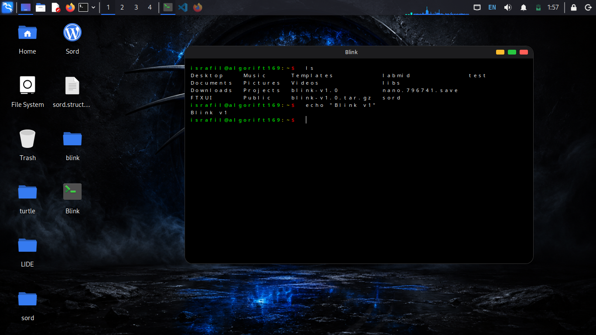

# Blink

Blink is a lightweight terminal application built with GTK and VTE. It provides a custom window frame, rounded corners, and an interactive shell experience.

## V1 Preview



## Features

- Custom UI window with rounded corners and a compact title bar.
- Shell launching in a PTY-backed terminal.
- Basic clipboard, search, and utility helpers.

## Requirements

- GCC or Clang with C++20 support.
- GTK 3 development files.
- VTE 2.91 development files.
- pkg-config and make.

## Install dependencies

```bash
./scripts/deps.sh
```

## Install V1 Release

```bash
wget https://github.com/Algorift169/blink/releases/download/v1.0.0/blink-v1.0.tar.gz && \
tar -xzf blink-v1.0.tar.gz && \
cd blink-v1.0 && \
chmod +x install.sh && \
./install.sh
```

## Build

```bash
make
```

## Run

```bash
./scripts/run.sh
```

## Documentation

See the documentation in the docs directory:

- docs/overview.md
- docs/architecture.md
- docs/development.md
- docs/features.md
